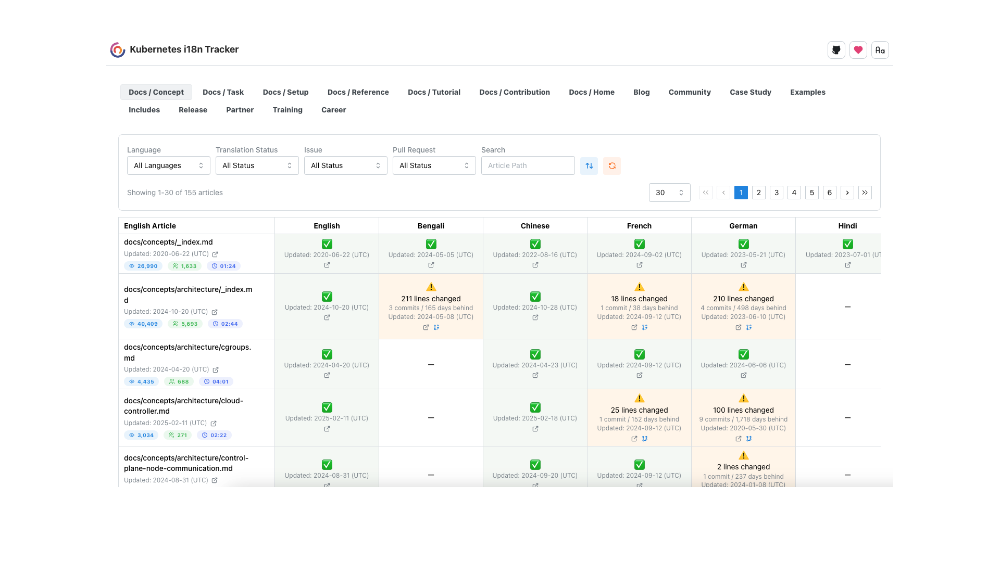

# kubernetes-i18n-Tracker

A dashboard to visualize and track the translation status of Kubernetes website documentation across different languages. This tool helps contributors and maintainers monitor localization progress and identify areas requiring translation efforts.

📍 **Live site**: [https://kfess.github.io/kubernetes-i18n-tracker](https://kfess.github.io/kubernetes-i18n-tracker) (Deployed on GitHub Pages)

##  

## 🚀 Features

- View translation status across all supported languages
- Track translation availability for each file

## 

## 🔗 Who is this for?

- **Localization contributors** who want to see which files need translation
- **SIG Docs reviewers** managing the progress of i18n
- **New translators** who want to identify good entry points for contribution

## 🧩 How it works

- Automatically fetches the latest kubernetes/website content daily
- Powered by GitHub Actions for reliable updates and deployment

## 🤝 Contribution

We welcome feedback, suggestions, and contributions.

If you'd like to help improve this dashboard, feel free to open an issue or pull request.
